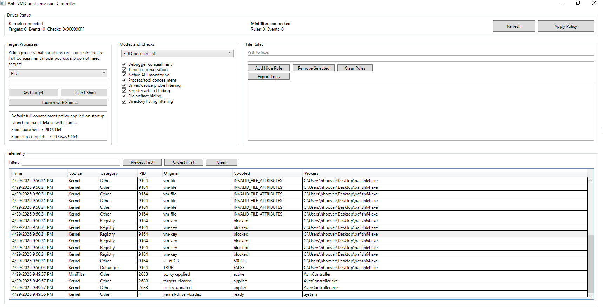

# Anti-VM-Awareness Countermeasure Platform

This project is a Windows lab tool for hiding common virtual machine artifacts from a target process. The goal is to make malware analysis inside a VM more realistic by reducing the obvious signs that the guest is virtualized.

It is built as a school project for defensive malware analysis. It is not a production security product.

## What Is Included

| Component | Purpose |
|---|---|
| `AvmKernel.sys` | Stores policy, blocks registry artifacts, and collects telemetry |
| `AvmMiniFilter.sys` | Hides VM-related files and directory entries |
| `AvmRuntimeShim.dll` | Hooks selected Windows APIs inside a launched target process |
| `AvmController.exe` | GUI used to apply policy, launch targets with the shim, and view telemetry |
| `AvmProbeTest.exe` | Simple validation program for checking what is still detectable |
| `build.ps1`  | A build script that signs the drivers, spoofs user activity, builds the binaries, and spoofs hardware information. |

## How It Works

The project hides VM artifacts in three layers:

1. The kernel driver blocks or spoofs selected registry results.
2. The minifilter hides selected files and folders.
3. The runtime shim hooks API calls inside a target process when you launch that process through the controller.

That means some concealment is system-wide, but some concealment only happens inside a process that was launched with the shim.

If you want the in-depth explanation, see [HOW_IT_WORKS.md](HOW_IT_WORKS.md).

## Requirements

- Windows x64 guest VM (I used VMware Workstation)
- Administrator PowerShell
- Test signing enabled
- Secure Boot disabled
- Memory Integrity / HVCI disabled

Build machine requirements:

- Visual Studio 2022
- Windows Driver Kit (I am not sure if this is required.)
- .NET Framework 4.8 developer pack

## Quick Start

### Build on the host

```powershell
.\build.ps1
```

This builds the project, signs the drivers, and copies the needed files into `dist\`.

### Install on the VM

Copy the files from `dist\` to the VM, open an elevated PowerShell window, and run:

```powershell
.\build.ps1 -Install
```

`-Install` reinstalls both drivers every time you run it. The script stops and deletes the old services, copies the new `.sys` files into `C:\Windows\System32\drivers\`, recreates the services, and starts them again.

Before installing, make sure test signing is enabled:

```powershell
bcdedit /set testsigning on
```

Reboot after changing that setting.

## Basic Usage

1. Run `AvmController.exe` as Administrator.
2. Click `Refresh` and make sure both drivers show as connected.
3. Leave the mode set to `Full Concealment`.
4. Click `Apply Policy`.
5. Use `Launch with Shim` to start `AvmProbeTest.exe` or another test program/malware.
6. Review the output and the telemetry panel.
7. Perform dynamic analysis.

Important: if you run a test program directly from `cmd.exe` instead of launching it through the controller, the runtime shim is not active for that process.

See [CONTROLLER_GUIDE.md](CONTROLLER_GUIDE.md) for the UI flow.

## What The Telemetry Means

The telemetry view shows which requests were intercepted and what the project returned instead.

The current UI shows:

- `Time`
- `Source`
- `Category`
- `PID`
- `Original`
- `Spoofed`
- `Process`

You can also filter, sort, and clear the telemetry list from the controller.

Below is an example image of the UI.


## Validation

### AvmProbeTest

Run it through `Launch with Shim` for the most useful result.

Expected pattern:

- Direct run: shows the real VM state
- Non-Shimmed run: shows some VM artifacts
- Shimmed run: shows what the target process can still detect after concealment

## Limitations

This project has important limits:

- It has only been tested in VMware. VMware is the main target environment for this project.
- VirtualBox artifact coverage exists in parts of the code and probe, but it has not been fully validated in a real VirtualBox test environment.
- Some concealment is process-scoped. The runtime shim only affects processes launched with the shim or injected manually.
- Direct runs of tools do not get user-mode API concealment.
- Direct syscalls and kernel-level malware can bypass user-mode hooks.
- Hardware or hypervisor-level signals are outside the scope of this project, although some documentation has been provided.
- Some checks are difficult or impossible to hide cleanly from inside the guest, including some timing-based checks and low-level hypervisor signals.
- The drivers are test-signed and intended for lab use only.

## Important Note

Some checks can only be fixed outside of the hypervisor. For my hypervisor, VMware, I set the following options in my VM's `.vmx` file:

- cpuid.1.ecx = "----:----:----:----:----:----:--0-:----"
- hypervisor.cpuid.v0 = FALSE
- ethernet0.address = "FC:4C:EA:2C:39:B4"

The MAC address can be set to any hex characters, preferably with a real vendor's assigned prefixes. I chose Dell because the `build.ps1` file also sets some information to look like a Dell computer. For more information, consult [this site](https://maclookup.app/vendors/dell-inc).

## Repository Layout

| Path | Purpose |
|---|---|
| `shared\avm_shared.h` | Shared structures and constants |
| `kernel\AvmKernel\` | Kernel driver |
| `minifilter\AvmMiniFilter\` | File system minifilter |
| `runtime\AvmRuntimeShim\` | Runtime shim DLL |
| `controller\AvmController\` | WPF controller |
| `probe\AvmProbeTest\` | Validation probe |
| `build.ps1` | Build, sign, package, and install script |

## Related Docs

- [HOW_IT_WORKS.md](HOW_IT_WORKS.md)
- [CONTROLLER_GUIDE.md](CONTROLLER_GUIDE.md)

## AI Disclosure

AI was used for parts of this project. AI was first used to brainstorm and create a project spec, followed by an implementation plan and specific prompting information. 

For prompt information, refer to [PROJECT_SPEC.md](PROJECT_SPEC.md), [IMPLEMENTATION_PLAN.md](IMPLEMENTATION_PLAN.md), and [prompt.txt](prompt.txt).